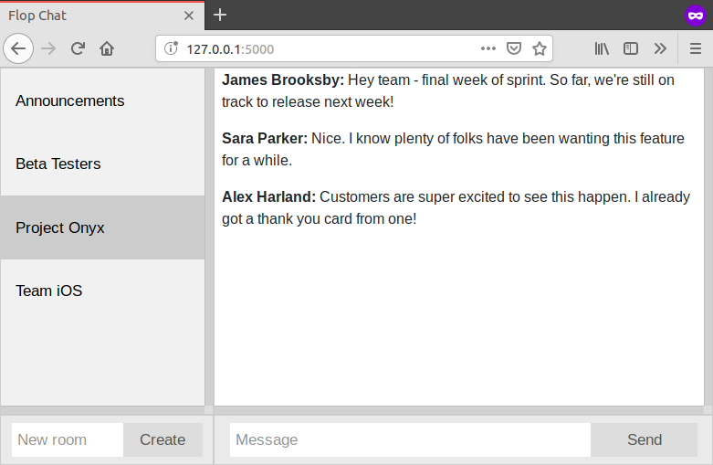

[Flop-Chat](https://github.com/ooyendyk/flop-chat) is a simple flask and socket.io chat app inspired by Slack.


# WDC Group Project
### AKA: eatSpot


#### Intro:
eatSpot is restaurant booking site like [OpenTable.com](OpenTable.com),
that I made as part of a university project. Initially it was supposed
to be a group project, but I ended up doing it solo as no one on my team
responded to my messages or showed up to class 😕.

For this project I used express.js (node.js) for the routing, 
sass/Bootstrap for the styling, and pug for templating. 

Unfortunately I never quite got around to finishing the project. Whist,
the front-end is mainly complete, the back-end has a [fair way to go](https://github.com/nerd-1/WDC-GroupProject/projects/2).

#### Overview:


#### Getting started:
```
npm install
sudo npm install -g nodemon
npm start
```

#### Links:
Project specs
- https://myuni.adelaide.edu.au/courses/45380/pages/2019-group-project-specification?module_item_id=1487509
- https://myuni.adelaide.edu.au/courses/45380/assignments/117700

#### Things to be done:
Check the open Projects tab or go here:
- https://github.com/ooyendyk/WDC-GroupProject/projects/2

#### Documentation:
[Here](https://github.com/ooyendyk/WDC-GroupProject/blob/master/documents)

