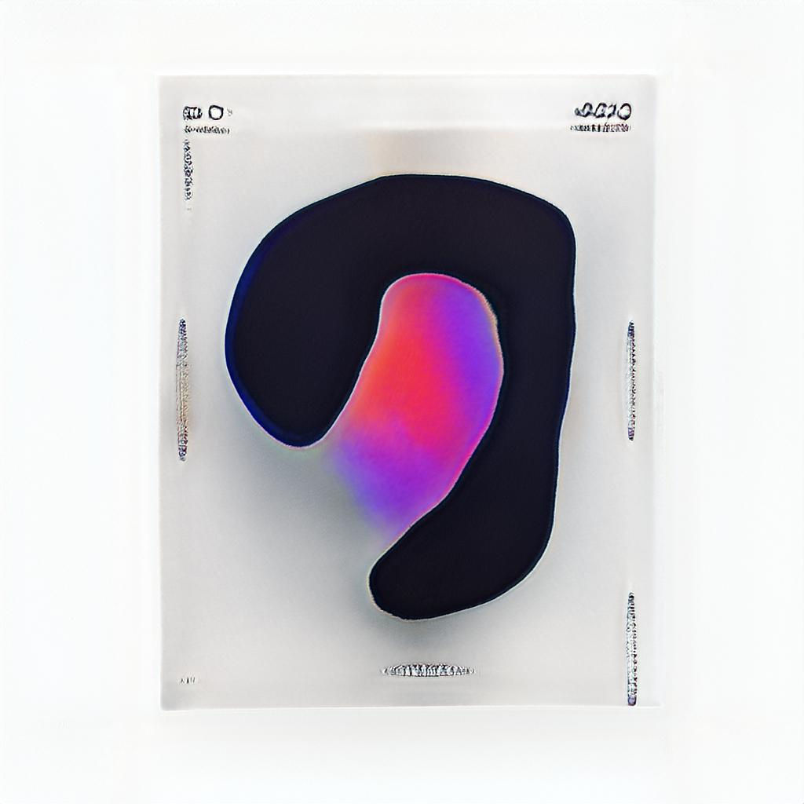
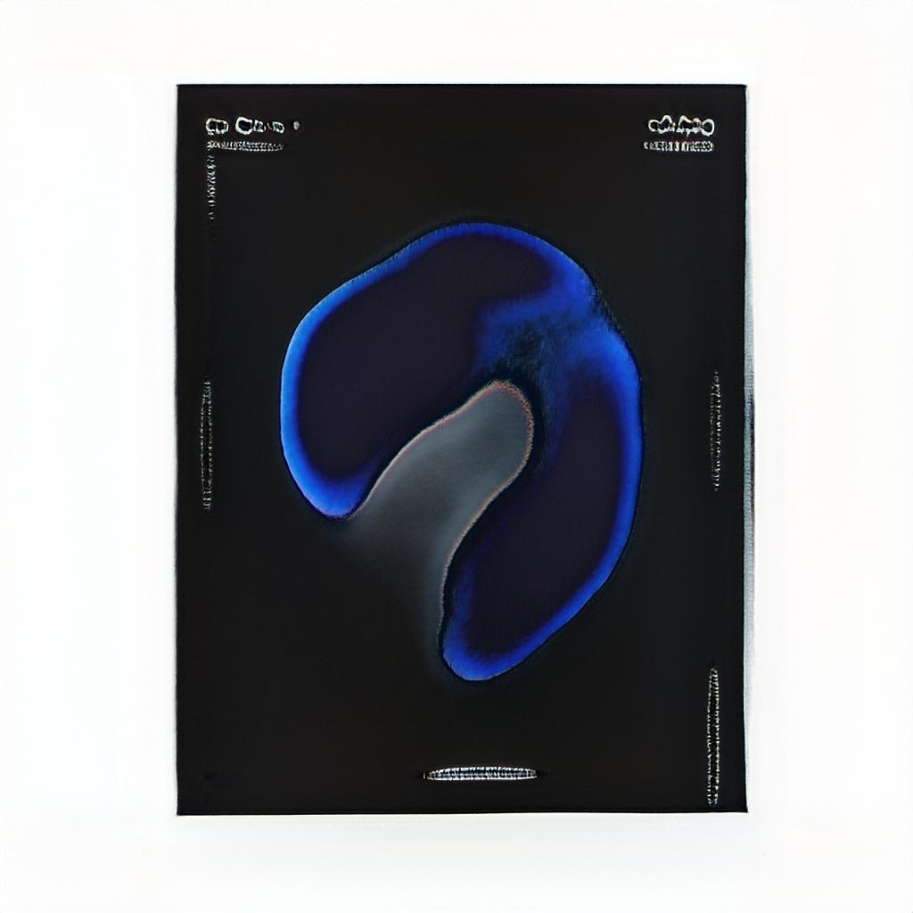
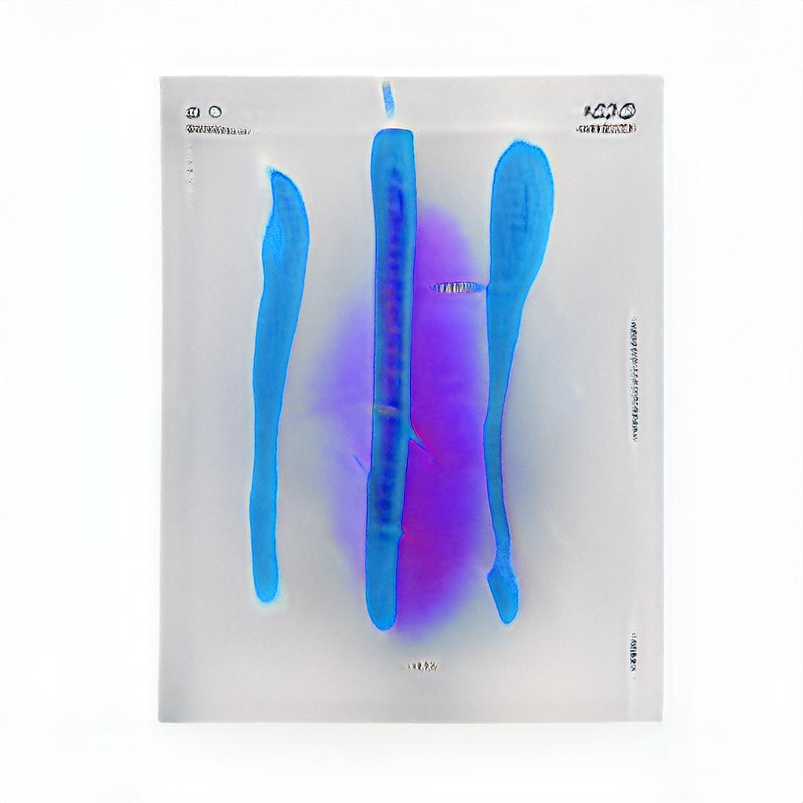
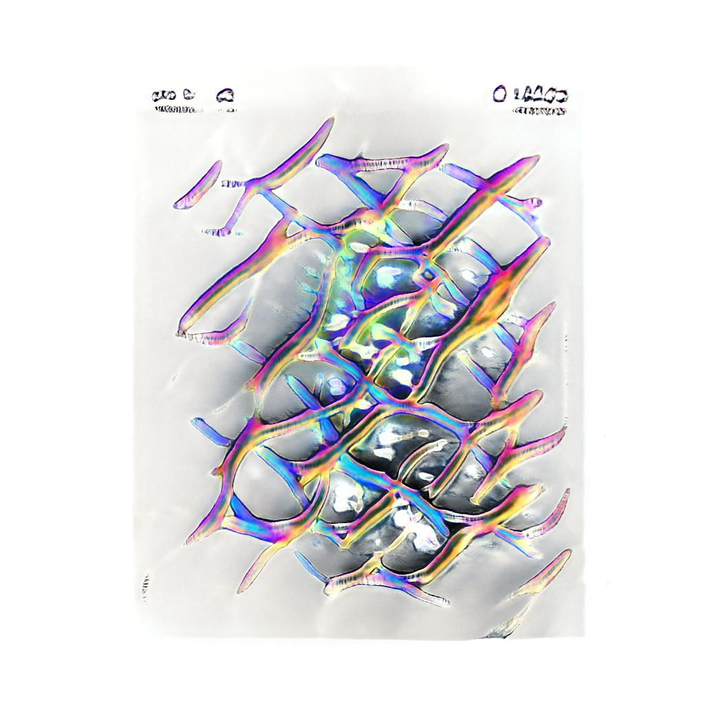
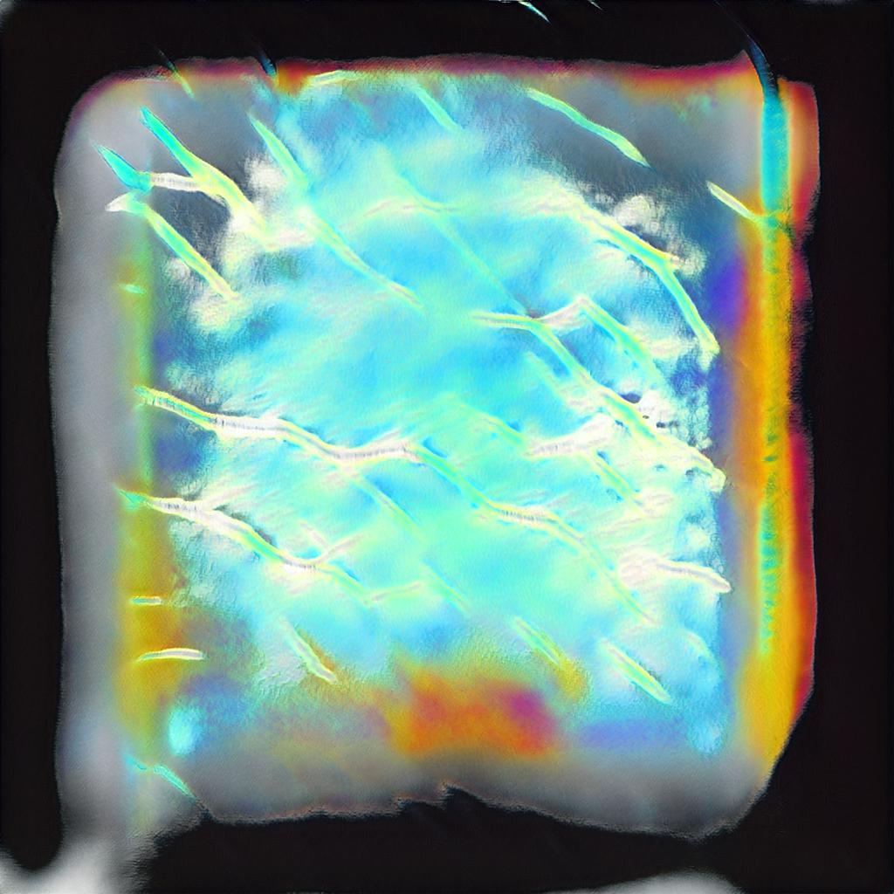

<video width="300" height="300" controls><source src="../images/mlART0.mp4" type="video/mlART0.mp4"></video>

 
 

After stumbling across some classic art/design magazines, I started toying with the idea of taking up digital art.

There was one problem with taking up a new hobby; I simply didn't have the time to learn a new skill.

Being a programmer, I decided to go for the obvious solution; automate it.

I decided to use machine learning, beacuse then I'd be almost completely removed from the artistic procces.

This is ideal, because then I'd have to exert no effort in coming up with the meaning behind the art.

I started out by scraping digital art from instagram. This dataset was then fed into styleGAN, and trained for 2000 epochs.

The resulting model was used to generate images, which were then pased to another ML algorithim,
SRCNN to upscale the images from 1042x1042 to 4096x4096.

