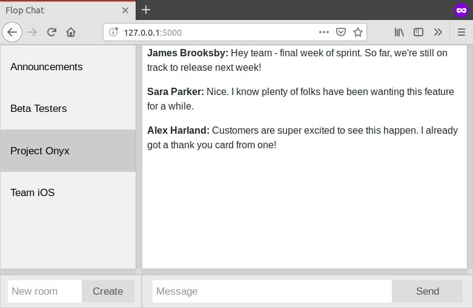

---
layout: project
type: project
image: images/JumpyRun.gif
title: Flop-Chat
permalink: projects/jumpy-run
# All dates must be YYYY-MM-DD format!
date: 2020-02-02
labels:
  - Unity
  - C#
  - Game

About:
--
My first ever game, Jumpy Run, is a 3D side-scroller that plays like an easy-mode Floppy Birds.

I developed the first playable prototype in an evening after downloading the Unity game engine on a whim.

Over the next day, I polished the gameplay, added a main menu, scoring and uploaded the release.

**Play the game [Here](https://ooyendyk.github.io/jumpy-run/)**

Download the game [here](https://github.com/ooyendyk/jumpy-run/releases)

Check out the source code [here](https://github.com/ooyendyk/jumpy-run)

[Flop-Chat](https://github.com/ooyendyk/flop-chat) is a simple flask and socket.io chat app inspired by Slack.
